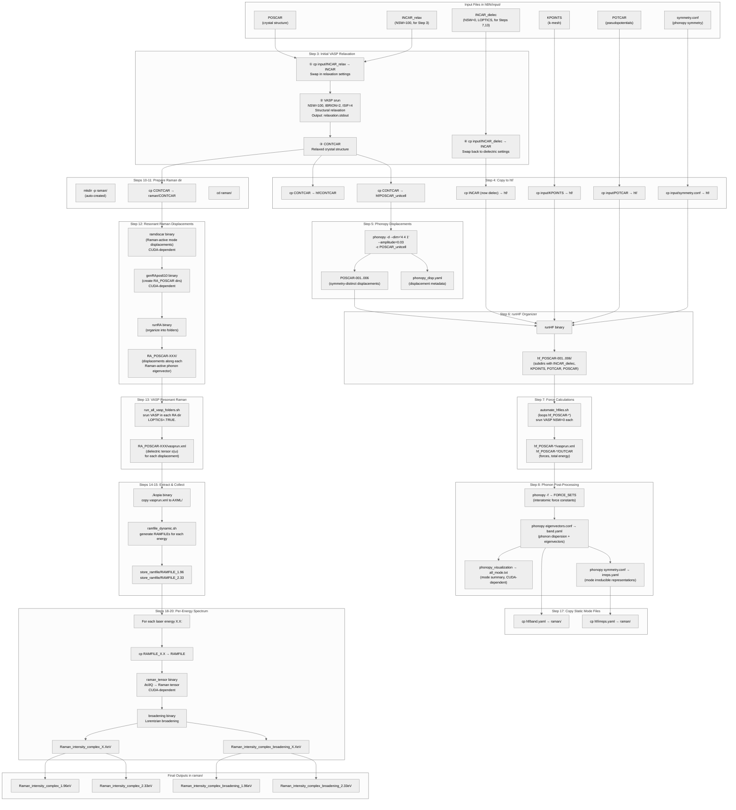

# hBN Raman Workflow — End-to-End Data Flow

> **What this pipeline does**: Compute the resonant Raman spectrum of hBN from first principles. The pipeline moves from crystal structure → phonons (lattice vibrations) → Raman tensor (light-scattering response) → final broadened spectrum for comparison with experiment.

## Physics Overview

```
DFT relaxation  →  Phonon force constants  →  Phonon modes (frequencies + eigenvectors)
                                                        ↓
Resonant displacements along Raman modes  →  Dielectric tensor ε(ω) for each displacement
                                                        ↓
Raman tensor = ∂ε/∂Q  →  Raman intensity
```

### Key quantities
| Symbol | Name | What it is |
|--------|------|------------|
| `Q` | Phonon normal coordinate | Collective atomic displacement pattern for one vibrational mode |
| `ε(ω)` | Dielectric tensor | How the material polarizes in response to an electric field at frequency ω |
| `∂ε/∂Q` | Raman tensor | How the dielectric tensor changes when the atom vibrates along mode Q |
| `ω_q` | Phonon frequency | Raman shift position (cm⁻¹) |
| `Γ` | Linewidth | Experimental broadening (Lorentzian HWHM) |

---

## Step-by-Step Physical Details

### Step 3: Initial VASP Relaxation

**What is calculated**: The equilibrium (minimum-energy) crystal structure.

VASP performs a structural relaxation (`NSW=100`, `IBRION=2`, `ISIF=4`):
- **Ions**: Move atoms to minimize Hellmann-Feynman forces (`EDIFFG`) — atoms settle into their equilibrium positions within the unit cell.
- **Cell**: Lattice vectors relax to zero stress — the unit cell size and shape adjust to their DFT-optimal values.
- **Charge density**: Self-consistent DFT loop solves the Kohn-Sham equations to find the ground-state electron density.

**Why it matters**: Every subsequent calculation depends on having the correct equilibrium geometry. Wrong geometry → wrong phonon frequencies → wrong Raman shifts.

**Output**: [`CONTCAR`](CONTCAR) — the relaxed crystal structure (used by all downstream steps).

---
### Step 4: Copy files to `hf/`

**What is calculated**: Nothing — purely file management.

The relaxed structure and VASP input files (INCAR with dielectric settings, KPOINTS, POTCAR) are copied into the `hf/` directory, which becomes the workspace for all phonon-related calculations.

---
### Step 5: Phonopy Displacement Generation

**What is calculated**: Symmetry-distinct atomic displacements for the finite-difference method.

Phonopy (`phonopy -d`) generates small displacements (±0.03 Å) of symmetrically inequivalent atoms:
- In a 4×4×1 supercell of hBN (32 atoms), there are only 6 symmetry-distinct displacement patterns (not 32×3 = 96!).
- Each `POSCAR-00N` file contains the same supercell but with one specific atom displaced slightly.

**Why this approach**: The harmonic force constants are:

$$F_{i} = -\frac{\partial E}{\partial u_i} \approx -\sum_j \Phi_{ij} u_j$$

where $u_j$ are displacements and $\Phi_{ij}$ are the force constants (interatomic force constant matrix). By displacing atoms one at a time and computing the resulting forces, we can extract $\Phi_{ij}$.

**Output**: [`POSCAR-001`](POSCAR-001) through [`POSCAR-006`](POSCAR-006) (displaced structures), [`phonopy_disp.yaml`](phonopy_disp.yaml) (metadata mapping displacements to atoms).

---
### Step 6: runHF Organizer

**What is calculated**: Nothing — file management.

The `runHF` binary copies INCAR, KPOINTS, POTCAR, and symmetry.conf into each `hf_POSCAR-00N/` subdirectory, creating self-contained VASP input directories for each displacement.

**Output**: `hf_POSCAR-001/` through `hf_POSCAR-006/` (each with INCAR, KPOINTS, POTCAR, POSCAR).

---
### Step 7: VASP Force-Constant Calculations

**What is calculated**: Hellmann-Feynman forces for each displaced structure.

For each `hf_POSCAR-00N/` directory, VASP runs a single-point DFT calculation (`NSW=0`):
- The atoms are held fixed at their displaced positions.
- VASP converges the electron density and computes the forces on every atom via the Hellmann-Feynman theorem.
- These forces are the **raw data** for the phonon dispersion.

**Physical picture**: Imagine pushing one atom slightly and measuring how all the other atoms "feel" it through the electron density. The induced forces tell us the spring constants between every pair of atoms.

**CPU vs GPU mode**: In GPU mode (`automate_hfiles.sh`), VASP runs on GPUs with `--gpus 4`. In CPU mode (`--cpu` flag), VASP runs directly with the CPU binary on CPU nodes — this is the main motivation for the `--cpu` flag (required for large supercells like 6×6×1 that OOM on 40GB GPUs).

**Output**: `hf_POSCAR-00N/vasprun.xml`, `hf_POSCAR-00N/OUTCAR` (forces and total energy for each displacement).

**Validation**: Before proceeding to Step 8, EVERY `vasprun.xml` is checked for the `</modeling>` closing tag — if any displacement run crashed (e.g., NBANDS too low, OOM), the pipeline stops with an error.

---
### Step 8: Phonon Post-Processing

#### 8a: Force Constants (phonopy -f)

**What is calculated**: The interatomic force constant matrix $\Phi_{ij}$.

Phonopy reads all `vasprun.xml` files and constructs `FORCE_SETS`:
- For each displacement $u_j$, it reads the resulting forces $F_i$ on all atoms.
- The force constant matrix element $\Phi_{ij} = -\partial F_i / \partial u_j$ is extracted via finite differences.
- This is a 3N × 3N matrix where N is the number of atoms in the supercell.

#### 8b: Phonon Eigenvectors (phonopy eigenvectors.conf)

**What is calculated**: Phonon frequencies (Raman shifts) and atomic displacement patterns.

Phonopy mass-weights the force constants to build the dynamical matrix $D(q)$:

$$D_{\alpha\beta}(ij, q) = \frac{1}{\sqrt{M_i M_j}} \sum_{R} \Phi_{\alpha\beta}(i0, jR) e^{iq \cdot R}$$

where $M_i$ are atomic masses and $R$ are lattice vectors. Diagonalizing $D(q)$ gives:
- **Eigenvalues** $\omega_q^2$ → phonon frequencies → Raman shifts (cm⁻¹)
- **Eigenvectors** $e_q$ → atomic displacement patterns for each mode

The band structure (`band.yaml`) traces $\omega_q$ along high-symmetry q-point paths in the Brillouin zone.

#### 8b: phonopy_visualization

**What it produces**: `all_mode.txt` — a human-readable table listing all phonon modes with frequencies and symmetries. **Only used for plotting** (`plot_raman_results.sh`), not by any critical pipeline step.

**CPU note**: This binary links CUDA — skipped on CPU nodes; `all_mode.txt` is not produced.

#### 8b: Symmetry Analysis (symmetry.conf)

**What is calculated**: Irreducible representations (irreps) of each phonon mode at the Γ-point (q=0, the Brillouin zone center).

**Why this matters**: Group theory determines which modes are **Raman-active**. A mode is Raman-active if its irrep transforms like a quadratic function (x², y², z², xy, etc.) under the crystal's symmetry operations. Only Raman-active modes appear in the spectrum.

**Output**: [`FORCE_SETS`](FORCE_SETS) (force constants), [`band.yaml`](band.yaml) (phonon dispersion + eigenvectors), [`irreps.yaml`](irreps.yaml) (mode symmetries).

---
### Step 9: Symmetry (legacy tracking)

This step is a no-op — the symmetry analysis was already completed in Step 8b.

---
### Steps 10–11: Prepare Raman Directory

**What is calculated**: Nothing — file management.

Creates the `raman/` directory and copies the relaxed structure (CONTCAR) and VASP input files (INCAR, KPOINTS, POTCAR) into it. The NBANDS in `raman/INCAR` is auto-scaled based on the supercell size.

---
### Step 12: Resonant Raman Displacements

**What is calculated**: Displacements along Raman-active phonon eigenvectors for the resonant Raman response.

Unlike Step 5 (which used random symmetry-distinct displacements), this step generates displacements specifically along the **Raman-active phonon eigenvectors**:

- `ramdiscar`: Reads the relaxed structure and the Raman-active mode eigenvectors from the phonon calculation.
- `genRApos610`: Creates displaced structures where each `RA_POSCAR-XXX` corresponds to a displacement along one Raman-active mode.
- `runRA`: Organizes each displacement into its own directory with INCAR, KPOINTS, POTCAR.

The number of displacements equals the number of Raman-active modes (e.g., hBN has 4 Raman-active modes: E₂g, E₁g, etc.).

**CPU note**: `ramdiscar` and `genRApos610` link CUDA — they will fail on CPU nodes. Without them, no `RA_POSCAR-*` directories are created and Steps 13–20 cannot proceed.

**Output**: `RA_POSCAR-XXX/` directories (with INCAR_dielec, KPOINTS, POTCAR, POSCAR).

---
### Step 13: Resonant Raman VASP Runs

**What is calculated**: The frequency-dependent dielectric tensor ε(ω) for each displaced structure.

For each `RA_POSCAR-XXX/` directory, VASP runs a single-point calculation with `LOPTICS=.TRUE.`:
- The ground-state electron density is computed (DFT).
- From the Kohn-Sham eigenvalues and wavefunctions, VASP computes the **frequency-dependent dielectric tensor** ε(ω) via the dipole transition matrix elements:

$$\varepsilon_{\alpha\beta}(\omega) = 1 + \frac{4\pi e^2}{\Omega} \sum_{c,v,k} \frac{\langle c,k|r_\alpha|v,k\rangle \langle v,k|r_\beta|c,k\rangle}{(\varepsilon_{c,k} - \varepsilon_{v,k} - \hbar\omega - i\eta)}$$

where $c$ = conduction bands, $v$ = valence bands, $k$ = k-points.

**Physical meaning**: ε(ω) tells us how the material polarizes when an electric field (light) of frequency ω is applied. Peaks in ε(ω) correspond to electronic transitions (absorption).

**Output**: `RA_POSCAR-XXX/vasprun.xml` (contains ε(ω) in the dielectric section).

---
### Step 14: Kopia

**What is calculated**: Nothing — file management.

The `kopia` binary copies all `vasprun.xml` files from `RA_POSCAR-XXX/` into a single `AXML/` directory with consistent naming.

---
### Step 15: Generate RAMFILEs

**What is calculated**: Extraction of the dielectric tensor at specific laser energies.

`ramfile_dynamic.sh` reads each `vasprun.xml` in `AXML/` and extracts ε(ω) at the requested laser energies. For each energy, it creates a `RAMFILE` containing the dielectric tensor data from every displacement — these are the input for the Raman tensor calculation.

**Typical energies**: 1.96 eV (632 nm HeNe laser), 2.33 eV (532 nm Nd:YAG), 2.54 eV (488 nm Ar⁺).

**Output**: `store_ramfile/RAMFILE_1.96`, `store_ramfile/RAMFILE_2.33`, etc.

---
### Step 17: Copy Static Mode Files

**What is calculated**: Nothing — file management.

Copies `band.yaml` (phonon eigenvectors) and `irreps.yaml` (mode symmetries) from `hf/` into `raman/` so the Raman tensor code can read them.

---
### Steps 18–20: Per-Energy Raman Spectrum

#### Raman Tensor Computation

**What is calculated**: The Raman tensor for each phonon mode at each laser energy.

`raman_tensor` reads:
- The RAMFILE (dielectric tensor ε(ω) for each displacement at energy ℏω)
- The phonon eigenvectors (from `band.yaml`) — tells us which atoms move in each mode

The Raman tensor for mode $q$ is the derivative of the dielectric tensor with respect to the normal coordinate $Q_q$:

$$R_{\alpha\beta}(\omega, q) = \frac{\partial \varepsilon_{\alpha\beta}(\omega)}{\partial Q_q}$$

This is computed via finite differences: the dielectric tensor from the `RA_POSCAR-XXX` runs (displaced along mode $q$) minus the dielectric tensor from the undisplaced structure, divided by the displacement amplitude.

**Physical meaning**: The Raman tensor quantifies how much the electronic polarizability changes when the atoms vibrate. A large change → strong Raman scattering.

#### Spectrum Broadening

**What is calculated**: The final Raman spectrum with experimental linewidths.

`broadening` takes the Raman tensors and:
1. Computes the Raman intensity for the given polarization configuration:
   $$I(\omega) \propto \sum_q |e_i \cdot R_q \cdot e_s|^2 \cdot \delta(\omega - \omega_q)$$
   where $e_i$ = incident polarization, $e_s$ = scattered polarization.
2. Convolves with a Lorentzian to account for finite phonon lifetime (experimental resolution):
   $$I_{\text{broadened}}(\omega) = \int I(\omega') \cdot \frac{\Gamma/\pi}{(\omega - \omega')^2 + \Gamma^2} d\omega'$$

**Output**: 
- `Raman_intensity_complex_X.XeV` — raw Raman tensor data
- `Raman_intensity_complex_broadening_X.XeV` — final broadened spectrum (ready for plotting)

---

## Mermaid Flowchart



## File Inventory Per Step

| Step | Script / Binary | Input Files | Output Files | Physical Quantity |
|------|----------------|-------------|--------------|-------------------|
| 3 | `cp` + `srun vasp_std` + `cp` | POSCAR, INCAR_relax, INCAR_dielec, KPOINTS, POTCAR | CONTCAR | Equilibrium crystal structure (minimum-energy geometry) |
| 4 | `cp` commands | CONTCAR, INCAR, KPOINTS, POTCAR, symmetry.conf | hf/{CONTCAR, POSCAR_unitcell, INCAR, KPOINTS, POTCAR, symmetry.conf} | — (file management) |
| 5 | `phonopy -d` | POSCAR_unitcell | POSCAR-001..006, phonopy_disp.yaml | Symmetry-distinct atomic displacements (±0.03 Å) |
| 6 | `runHF` | POSCAR-*, INCAR, KPOINTS, POTCAR, symmetry.conf | hf_POSCAR-*/ subdirs | — (file management) |
| 7 | `automate_hfiles.sh` / `srun vasp_std` | hf_POSCAR-*/ (INCAR_dielec, KPOINTS, POTCAR) | hf_POSCAR-*/vasprun.xml, OUTCAR | Hellmann-Feynman forces for each displaced structure |
| 8 | `phonopy -f`, `eigenvectors.conf`, `symmetry.conf` | vasprun.xml files | FORCE_SETS, band.yaml, irreps.yaml, all_mode.txt | Interatomic force constants → phonon frequencies + eigenvectors + mode symmetries |
| 9 | (already done in Step 8) | — | — | — |
| 10-11 | `cp` + `cd` | CONTCAR | raman/CONTCAR | — (file management) |
| 12 | `ramdiscar`, `genRApos610`, `runRA` | CONTCAR | RA_POSCAR-*/ subdirs | Displacements along Raman-active phonon eigenvectors |
| 13 | `run_all_vasp_folders.sh` + `srun vasp_std` | RA_POSCAR-*/ (INCAR_dielec, KPOINTS, POTCAR) | RA_POSCAR-*/vasprun.xml | Frequency-dependent dielectric tensor ε(ω) for each displacement |
| 14 | `kopia` | vasprun.xml files | AXML/ | — (file management) |
| 15 | `ramfile_dynamic.sh` | AXML/ | store_ramfile/RAMFILE_1.96, RAMFILE_2.33 | ε(ω) extracted at specific laser energies |
| 17 | `cp` | hf/band.yaml, irreps.yaml | raman/band.yaml, raman/irreps.yaml | — (file management) |
| 18-20 | `raman_tensor` + `broadening` | RAMFILE, band.yaml, irreps.yaml | Raman_intensity_complex_X.XeV, Raman_intensity_complex_broadening_X.XeV | Raman tensor R = ∂ε/∂Q → broadened spectrum I(ω) |

## INCAR Comparison

| INCAR Tag | `INCAR_relax` | `INCAR_dielec` | Purpose |
|-----------|:---:|:---:|---------|
| `NSW` | **100** | **0** | Relax: allow ionic movement; Dielec: single-point |
| `IBRION` | 2 | 2 | Conjugate-gradient (only active when NSW>0) |
| `ISIF` | 4 | 4 | Relax ions + cell shape (only active when NSW>0) |
| `EDIFF` | **1E-07** | **1E-08** | Dielec needs tighter electronic convergence for ε(ω) |
| `SIGMA` | **0.05** | **0.001** | Relax: broader smearing helps convergence; Dielec: cold smearing for accuracy |
| `LOPTICS` | *(absent)* | **.TRUE.** | Only compute ε(ω) in displacement VASP runs |
| `LCHARG` | **.TRUE.** | **.FALSE.** | Save charge density during relaxation; skip for dielectric runs |
| `LWAVE` | **.TRUE.** | **.FALSE.** | Save wavefunctions during relaxation; skip for dielectric runs |
| `NBANDS` | *(default)* | **auto-scaled** | Explicit bands needed for LOPTICS (empty states for transitions) |
| `NEDOS` | *(default)* | **50001** | Fine energy grid for dielectric function |
| `OMEGAMAX` | *(default)* | **50** | Calculate ε(ω) up to 50 eV |
| `ISTART` | **0** | **1** | Fresh start for relaxation; try reading WAVECAR for dielec |
| `ICHARG` | **2** | **1** | Start from atomic densities; read CHGCAR for dielec |

## CPU Node Limitations

The following binaries link CUDA (`libcudart.so.12`) and will fail on CPU nodes:

| Binary | Step | Produces | Critical? | Behavior on CPU |
|--------|:----:|----------|:---------:|-----------------|
| `phonopy_visualization` | 8 | `all_mode.txt` (mode summary) | ❌ Plotting only | Skipped — warning printed |
| `phonopy_symmetry` | 8 | reads `all_mode.txt` | ❌ Plotting only | Skipped — `all_mode.txt` missing |
| `ramdiscar` | 12 | Raman displacement data | ✅ Yes | Fails silently — Step 13-20 cannot proceed |
| `genRApos610` | 12 | `RA_POSCAR-*` dirs | ✅ Yes | Fails silently — Step 13-20 cannot proceed |
| `raman_tensor` | 18 | Raman spectra | ✅ Yes | Fails silently — no final spectra |

**Recommendation**: Run Steps 3–7 on CPU for large supercells (e.g., 6×6×1). For Steps 8–20, run on a GPU node or login node where CUDA is available.
