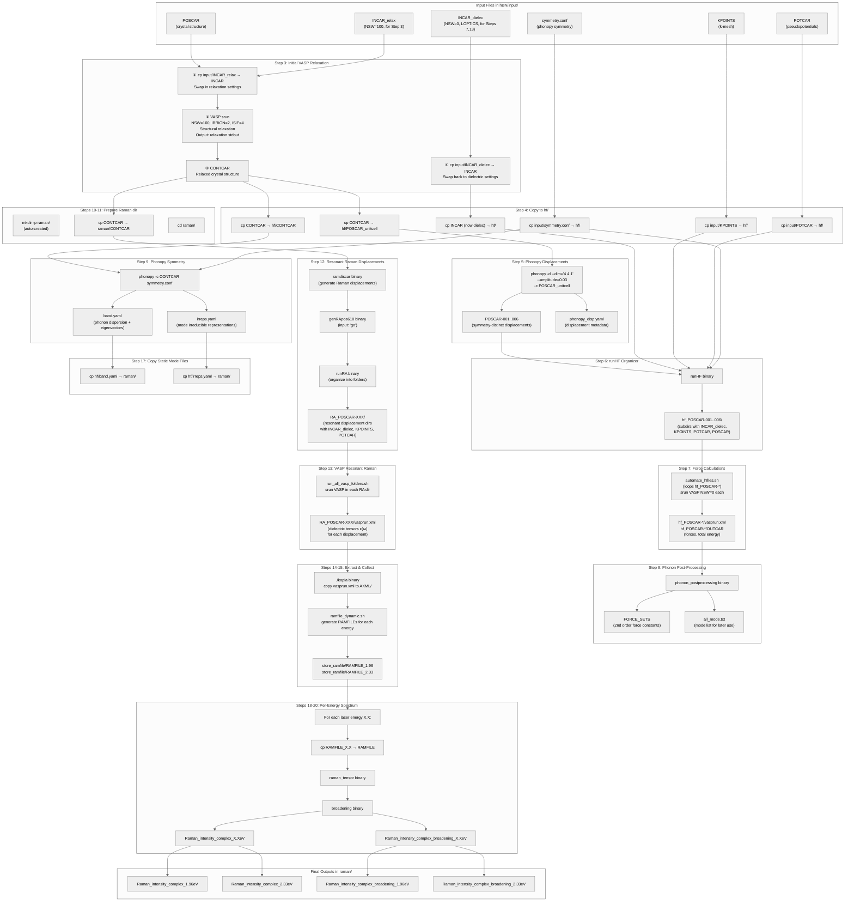

# hBN Raman Workflow — End-to-End Data Flow
> **[DEEPSEEK 2026-05-27]** Updated to document the dual-INCAR design (backward-compatible).
> To revert: restore the original single-INCAR version.

> **Dual-INCAR design**: Each material directory contains **two INCAR templates**:
> - [`INCAR_relax`](INCAR_relax) — For Step 3 structural relaxation (`NSW=100`, `IBRION=2`, `ISIF=4`, no `LOPTICS`, `SIGMA=0.05`, `LCHARG=.TRUE.`)
> - [`INCAR_dielec`](INCAR_dielec) — For all dielectric/displacement VASP runs (`NSW=0`, `LOPTICS=.TRUE.`, `NBANDS=64`, `SIGMA=0.001`)
>
> The script swaps `INCAR_relax` → `INCAR` before Step 3, then `INCAR_dielec` → `INCAR` after Step 3. All subsequent steps use the dielectric INCAR.
>
> **Backward compatible**: If only a single `INCAR` file exists (no `INCAR_relax`/`INCAR_dielec`), the script uses it directly with no swapping — preserving the original behavior for legacy/John Ornl data.

## File Inventory Per Step

| Step | Script / Binary | Input Files | Output Files |
|------|----------------|-------------|--------------|
| 3 | `cp` + `srun vasp_std` + `cp` | POSCAR, **input/INCAR_relax**, **input/INCAR_dielec**, input/KPOINTS, input/POTCAR | CONTCAR, relaxation.stdout (INCAR swapped back to dielec after); other generated files moved to scf/ (CHGCAR, WAVECAR, DOSCAR, OUTCAR, etc.) |
| 4 | `cp` commands | CONTCAR, INCAR (dielec), input/KPOINTS, input/POTCAR, input/symmetry.conf | hf/{CONTCAR, POSCAR_unitcell, INCAR, KPOINTS, POTCAR, symmetry.conf} |
| 5 | `phonopy -d` | POSCAR_unitcell | POSCAR-001..006, phonopy_disp.yaml |
| 6 | `runHF` | POSCAR-*, INCAR, KPOINTS, POTCAR, symmetry.conf | hf_POSCAR-*/ subdirs |
| 7 | `automate_hfiles.sh` | hf_POSCAR-*/ (INCAR_dielec, KPOINTS, POTCAR) | hf_POSCAR-*/vasprun.xml, OUTCAR |
| 8 | `phonon_postprocessing` | vasprun.xml files | FORCE_SETS, all_mode.txt |
| 9 | `phonopy -c CONTCAR symmetry.conf` | CONTCAR, symmetry.conf | band.yaml, irreps.yaml |
| 10-11 | `cp` + `cd` | CONTCAR | raman/CONTCAR |
| 12 | `ramdiscar`, `genRApos610`, `runRA` | CONTCAR | RA_POSCAR-*/ subdirs |
| 13 | `run_all_vasp_folders.sh` | RA_POSCAR-*/ (INCAR_dielec, KPOINTS, POTCAR) | RA_POSCAR-*/vasprun.xml |
| 14 | `kopia` | vasprun.xml files | AXML/ |
| 15 | `ramfile_dynamic.sh` | AXML/ | store_ramfile/RAMFILE_1.96, RAMFILE_2.33 |
| 17 | `cp` | hf/band.yaml, irreps.yaml | raman/band.yaml, raman/irreps.yaml |
| 18-20 | `raman_tensor` + `broadening` | RAMFILE, band.yaml, irreps.yaml | Raman_intensity_complex_X.XeV, Raman_intensity_complex_broadening_X.XeV |

## INCAR Comparison

| INCAR Tag | [`INCAR_relax`](INCAR_relax) | [`INCAR_dielec`](INCAR_dielec) | Purpose |
|-----------|:---:|:---:|---------|
| `NSW` | **100** | **0** | Relax: allow ionic movement; Dielec: single-point |
| `IBRION` | 2 | 2 | Conjugate-gradient (only active when NSW>0) |
| `ISIF` | 4 | 4 | Relax ions + cell shape (only active when NSW>0) |
| `EDIFF` | **1E-07** | **1E-08** | Dielec needs tighter electronic convergence for ε(ω) |
| `SIGMA` | **0.05** | **0.001** | Relax: broader smearing helps convergence; Dielec: cold smearing for accuracy |
| `LOPTICS` | ***(absent)*** | **.TRUE.** | Only compute ε(ω) in displacement VASP runs |
| `LCHARG` | **.TRUE.** | **.FALSE.** | Save charge density during relaxation; skip for dielectric runs |
| `LWAVE` | **.TRUE.** | **.FALSE.** | Save wavefunctions during relaxation; skip for dielectric runs |
| `NBANDS` | *(default)* | **64** | Explicit bands needed for LOPTICS (empty states) |
| `NEDOS` | *(default)* | **50001** | Fine energy grid for dielectric function |
| `OMEGAMAX` | *(default)* | **50** | Calculate ε(ω) up to 50 eV |
| `ISTART` | **0** | **1** | Fresh start for relaxation; try reading WAVECAR for dielec |
| `ICHARG` | **2** | **1** | Start from atomic densities; read CHGCAR for dielec |
